# Net
### Net 0
```c
#include "../common/common.c"

#define NAME "net0"
#define UID 999
#define GID 999
#define PORT 2999

void run()
{
  unsigned int i;
  unsigned int wanted;

  wanted = random();

  printf("Please send '%d' as a little endian 32bit int\n", wanted);

  if(fread(&i, sizeof(i), 1, stdin) == NULL) {
      errx(1, ":(\n");
  }

  if(i == wanted) {
      printf("Thank you sir/madam\n");
  } else {
      printf("I'm sorry, you sent %d instead\n", i);
  }
}

int main(int argc, char **argv, char **envp)
{
  int fd;
  char *username;

  /* Run the process as a daemon */
  background_process(NAME, UID, GID); 
  
  /* Wait for socket activity and return */
  fd = serve_forever(PORT);

  /* Set the client socket to STDIN, STDOUT, and STDERR */
  set_io(fd);

  /* Don't do this :> */
  srandom(time(NULL));

  run();
}
```
Mình thử chạy chương trình và không có gì xảy ra cả, tuy nhiên dùng lệnh `ps aux | grep net0` thì thầy 1 background process:

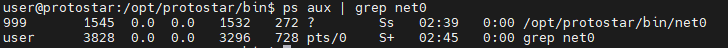

Trong source code include 1 file `common.c` và sử dụng 1 số hàm nonstandard, vì vậy mình sẽ dùng `strace` để kiểm tra:

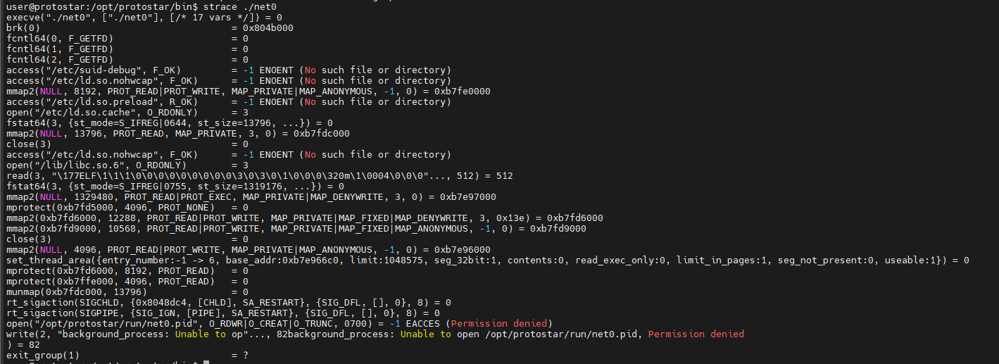

Vì gặp lỗi `Permission denied` nên mình sẽ thử chạy bằng quyền root xem sao. Quan sát thấy tiến trình có gọi hàm `clone()` nên mình sẽ dùng `strace -f ./net0` để quan sát cả những tiến trình con:

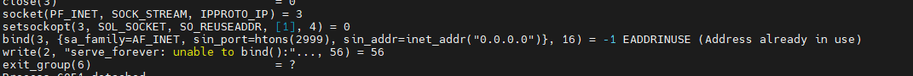

Có vẻ tiến trình tạo 1 socket, nhưng lại gặp lối `Address already in use` do địa chỉ này đã được sử dụng bởi net0 trước đó. Mình sẽ `kill` và thử lại:

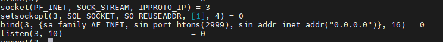

Sử dụng `netstat -plant`:

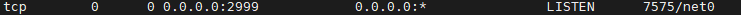

Tiến trình mình đang quan tâm đang nghe ở địa chỉ `0.0.0.0:2999`. Mình netcat đến địa chỉ này thì thấy yêu cầu chuyển 1 số ngẫu nhiên sang dạng little endian 32bit. Mình dùng python:

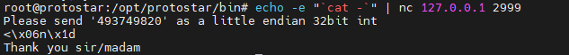
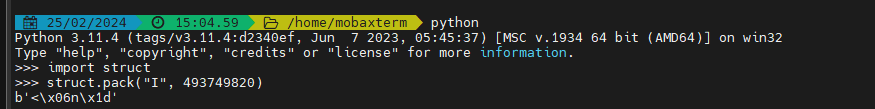

### Net 1
```c
#include "../common/common.c"

#define NAME "net1"
#define UID 998
#define GID 998
#define PORT 2998

void run()
{
  char buf[12];
  char fub[12];
  char *q;

  unsigned int wanted;

  wanted = random();

  sprintf(fub, "%d", wanted);

  if(write(0, &wanted, sizeof(wanted)) != sizeof(wanted)) {
      errx(1, ":(\n");
  }

  if(fgets(buf, sizeof(buf)-1, stdin) == NULL) {
      errx(1, ":(\n");
  }

  q = strchr(buf, '\r'); if(q) *q = 0;
  q = strchr(buf, '\n'); if(q) *q = 0;

  if(strcmp(fub, buf) == 0) {
      printf("you correctly sent the data\n");
  } else {
      printf("you didn't send the data properly\n");
  }
}

int main(int argc, char **argv, char **envp)
{
  int fd;
  char *username;

  /* Run the process as a daemon */
  background_process(NAME, UID, GID); 
  
  /* Wait for socket activity and return */
  fd = serve_forever(PORT);

  /* Set the client socket to STDIN, STDOUT, and STDERR */
  set_io(fd);

  /* Don't do this :> */
  srandom(time(NULL));

  run();
}
```
Tương tự như net0, mình xác định được cổng mà tiến trình con do net1 tạo ra đang lắng nghe, netcat đến đó:

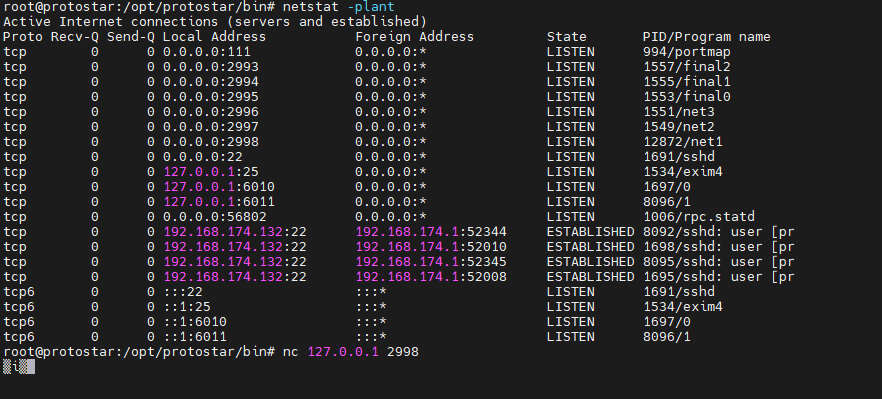

Quỷ T_T. Nhìn bình thường thì sẽ không biết ký tự mà server gửi đến là gì nên mình sẽ xem bên cửa sổ mà mình đã dùng lệnh `strace` trước đó:

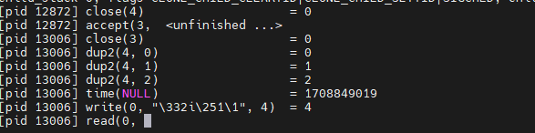

Rõ ràng hơn rồi. Kết hợp với việc đọc source code có thể thấy 1 số int `wanted` được sinh ngẫu nhiên, lưu vào mảng ký tự `fub`. Sau đó server sẽ gửi 4 byte biểu diễn số đó cho client, nhận lại input, lưu vào `buf` và so sánh với `fub`. Nhiệm vụ của mình bây giờ sẽ là chuyển 4 byte đó về lại dạng số nguyên int và chuyển thành xâu là xong:

```py
#!/usr/bin/env python

import socket
import struct

if __name__ == "__main__":
        s = socket.socket()
        s.connect(("127.0.0.1", 2998))
        data = s.recv(1024)

        temp = "0x"
        for c in reversed(data):
                temp += c.encode('hex')
        print "temp:", temp

        result = str(int(temp, 0))
        s.send(result)

        data = s.recv(1024)
        print(data)

        s.close()
```
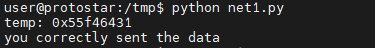

### Net 2
```c
#include "../common/common.c"

#define NAME "net2"
#define UID 997
#define GID 997
#define PORT 2997

void run()
{
  unsigned int quad[4];
  int i;
  unsigned int result, wanted;

  result = 0;
  for(i = 0; i < 4; i++) {
      quad[i] = random();
      result += quad[i];

      if(write(0, &(quad[i]), sizeof(result)) != sizeof(result)) {
          errx(1, ":(\n");
      }
  }

  if(read(0, &wanted, sizeof(result)) != sizeof(result)) {
      errx(1, ":<\n");
  }


  if(result == wanted) {
      printf("you added them correctly\n");
  } else {
      printf("sorry, try again. invalid\n");
  }
}

int main(int argc, char **argv, char **envp)
{
  int fd;
  char *username;

  /* Run the process as a daemon */
  background_process(NAME, UID, GID); 
  
  /* Wait for socket activity and return */
  fd = serve_forever(PORT);

  /* Set the client socket to STDIN, STDOUT, and STDERR */
  set_io(fd);

  /* Don't do this :> */
  srandom(time(NULL));

  run();
}
```
Tương tự net1, đọc source code mình thấy server sẽ sinh ra 4 số ngẫu nhiên, tính tổng 4 số đó `result`, gửi 4 số đó cho client, nhận lại `wanted` từ client và so sánh nó vs `result`. Dễ dàng thấy mục tiêu của ta là phải tính tổng 4 số đó và gửi lại server:

```py
#!/usr/bin/env python

import socket
import struct

if __name__ == "__main__":
        s = socket.socket()
        s.connect(("127.0.0.1", 2997))

        result = 0
        for i in range(4):
                data = s.recv(1024)
                temp = "0x"
                for c in reversed(data):
                        temp += c.encode('hex')
                result += int(temp, 0)
        

        s.send(str(struct.pack("I", result)))

        data = s.recv(1024)
        print(data)

        s.close()         
```

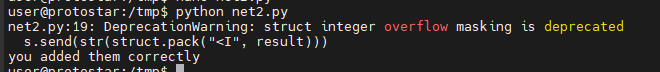

Thông báo lỗi "DeprecationWarning: struct integer overflow masking is deprecated" xuất hiện khi sử dụng một cách thức cũ, không an toàn hoặc không được khuyến nghị nữa trong Python. Tuy nhiên mình có thể bỏ qua vì nó không ảnh hưởng đến kết quả.